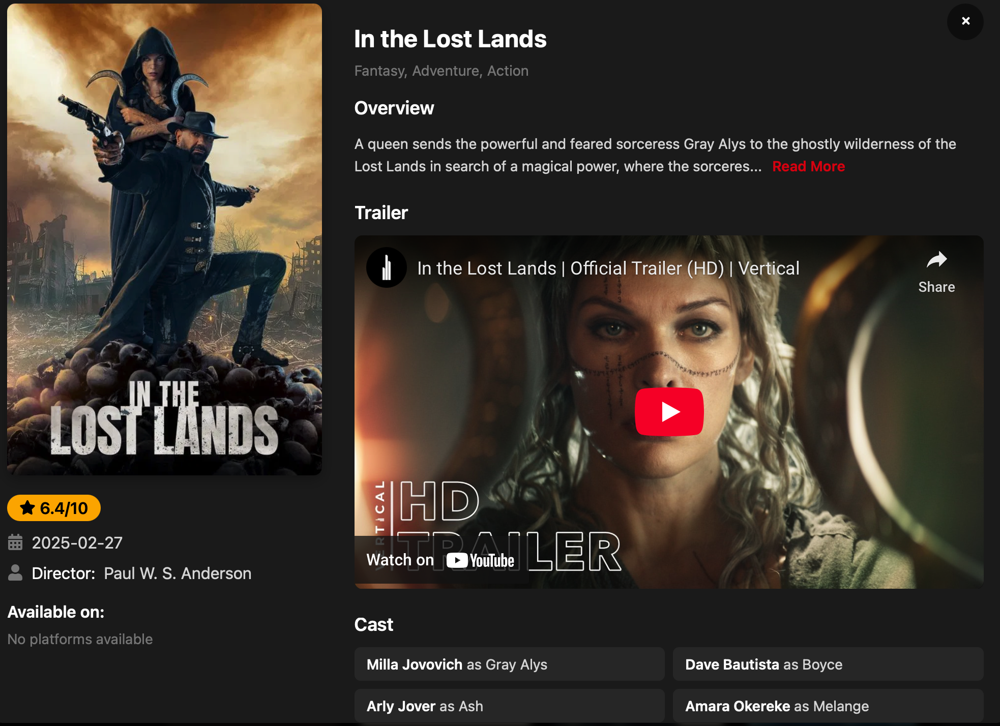
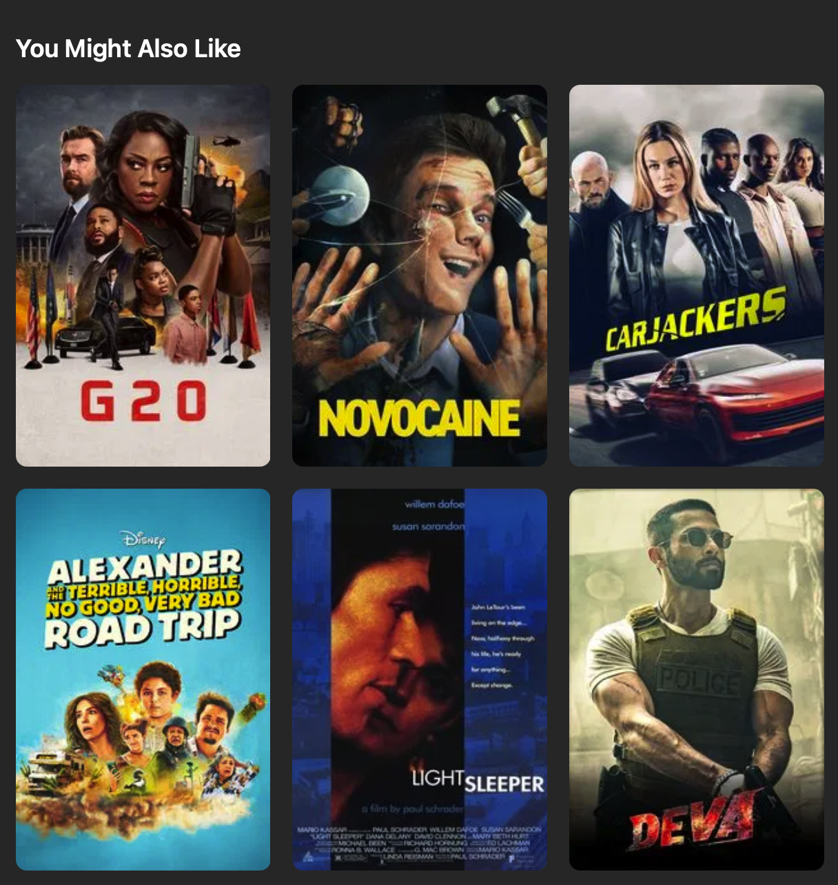

# 🍿 Popcorn Hub

> A modern movie discovery platform combining React + FastAPI + Machine Learning for intelligent movie recommendations.





## 🌟 Features

### 🎬 Core Functionality
- **Multi-Genre Browsing** – Bollywood, Hollywood, Punjabi & more
- **Smart Search** – Find movies by title across all genres
- **Pagination** – Smooth navigation through movie collections
- **Responsive Design** – Mobile & desktop optimized

### 🤖 AI-Based Recommendations
- **Content-Based Suggestions** – Based on movie similarities
- **Personalized Feed** *(Coming Soon)* – Watch-history-driven
- **Movie DNA Analysis** – Using NLP on metadata (genre, cast, crew)

---

## 🛠️ Tech Stack

| Layer        | Tech                                                                 |
|--------------|----------------------------------------------------------------------|
| **Frontend** | React, HTML, CSS, JavaScript, React Router                           |
| **Backend**  | FastAPI, Python 3.10+, scikit-learn, Pandas                          |
| **APIs**     | TMDB API, Custom ML Recommender Engine                               |
| **Hosting**  | Vercel (Frontend)                                                    |

---

## 🚀 Getting Started

### ✅ Prerequisites
- Node.js v16+
- Python 3.10+
- TMDB API key

### 🧩 Installation

1. **Clone Repositories**
```bash
git clone https://github.com/yourusername/popcorn-hub-frontend.git
git clone https://github.com/yourusername/movie-recommender-fastapi.git


### Frontend Setup

cd popcorn-hub-frontend
npm install

### Backend Setup

cd ../movie-recommender-fastapi
python -m venv venv
source venv/bin/activate  # For Linux/Mac
# OR
venv\Scripts\activate     # For Windows

pip install -r requirements.txt

### Environment Variables Create .env.local in the frontend root:

VITE_IMDB_APP_API_KEY=your_tmdb_key
VITE_FASTAPI_URL=http://localhost:8000


### Running the App

uvicorn main:app --reload


Start Frontend:-

npm run dev
npm run dev


 ### How It Works: Recommendation Engine

 graph TD
A[User Input] --> B(TMDb Data)
B --> C[Feature Engineering]
C --> D[NLP Vectorization]
D --> E[Cosine Similarity]
E --> F[Recommended Movies]


### 📁 Project Structure

popcorn-hub/
├── frontend/        # React App
│   ├── public/      
│   └── src/         
│       ├── components/
│       ├── lib/
│       └── types/
│
├── backend/         # FastAPI Backend
│   ├── data/
│   ├── models/
│   ├── routes/
│   └── recommender.py
│
└── datasets/
    ├── tmdb_5000_movies.csv
    └── tmdb_5000_credits.csv

### 🚧 Roadmap

**Current Limitations**
Requires exact movie title match
Dataset limited to 5000 entries

**Upcoming Features**
 TF-IDF vectorization
 Fuzzy search / partial match
 Real-time collaborative filtering
 Dark mode toggle
 User ratings


### 📚 Resources

TMDB Dataset (Kaggle)
FastAPI Deployment Guide
React Performance Doc

### 📜 License

This project is licensed under the MIT License.

Made with ❤️ by Vijay Kumar