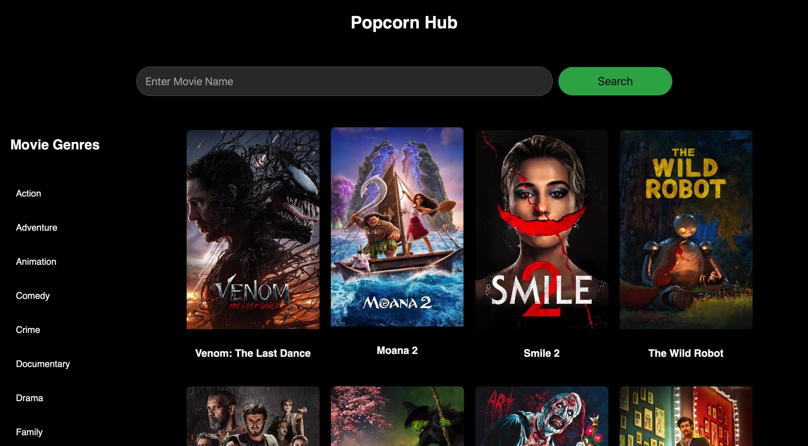

Here’s an updated README with the new features and adjustments you’ve made to your movie app:

---

# Popcorn Hub

A React-based movie app that fetches and displays popular movies from various genres, including Bollywood, Hollywood, and Punjabi cinema. The app allows users to search for movies, view their details by clicking on movie cards, and navigate through pages of movies with the new pagination feature.



## Features

- **Movie Sections**: View movies from different genres like Bollywood, Hollywood, Punjabi, and more.
- **Genre Filtering**: Users can filter movies by specific genres such as Action, Comedy, Drama, etc.
- **Search Functionality**: Search movies by title across all genres.
- **Pagination**: Navigate through pages of movie results instead of infinite scroll.
- **Loading Indicator**: Display a loading spinner when fetching data or during a genre change.
- **Responsive Design**: Mobile-friendly design that adapts to different screen sizes.
- **Movie Details**: Click on any movie card to view additional details like release date, rating, description, etc.

## Tech Stack

- **Frontend**: React, HTML5, CSS3, JavaScript
- **API**: The Movie Database (TMDb) API for fetching movie data
- **State Management**: React's `useState` and `useEffect` hooks
- **Styling**: Custom CSS for styling components
- **Routing**: React Router for navigation between different movie sections

## Setup

### Prerequisites

- Node.js and npm installed on your machine.

### Install Dependencies

1. Clone the repository:

    ```bash
    git clone https://github.com/hii-vijayy/MovieSearchApp.git
    ```

2. Navigate to the project directory:

    ```bash
    cd MovieSearchApp
    ```

3. Install the dependencies:

    ```bash
    npm install
    ```

4. Set up your environment variables:
   
    Create a `.env` file in the root directory and add your API key for TMDb:

    ```bash
    VITE_IMDB_APP_API_KEY=<your-api-key>
    ```

    You can get an API key by signing up at [TMDb](https://www.themoviedb.org/).

### Run the App

Start the development server:

```bash
npm run dev
```

## Genre Feature

- **View Movies by Genre**: Select a genre to view a list of movies. The app supports various genres such as:
  - Action
  - Adventure
  - Comedy
  - Drama
  - Horror
  - Romance
  - And more...

## Loading Indicator

- **Loading Spinner**: A loading spinner is displayed whenever new movie data is being fetched, such as during a genre change or movie search.

## Pagination

- **Pagination**: The app now uses pagination instead of infinite scroll. Navigate through movie pages using the `Next` and `Previous` buttons. Each page displays a set number of movies, allowing for better control and performance when browsing large lists.

## Movie Card Details

- **Movie Card**: Each movie card displays comprehensive details about the movie, including:
  - Movie Title
  - Release Date
  - Rating
  - Overview/Description
  - Poster Image
  - Cast
  - Trailer
  - Platform Availability

Users can click on a movie card to view additional information about the selected movie.

## Future Features

- **User Authentication**: Option for users to save their favorite movies.
- **Dark Mode**: Add a dark mode toggle for a better user experience.
