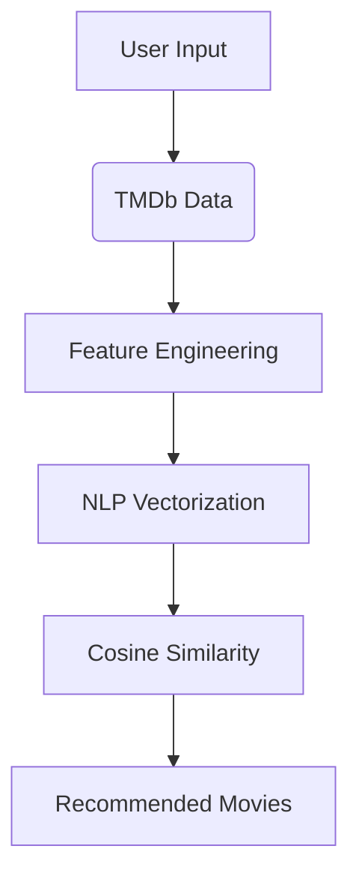

# 🍿 Popcorn Hub

> A modern movie discovery platform combining React + FastAPI + Machine Learning for intelligent movie recommendations.


## 🌟 Features

### 🎬 Core Functionality
- **Multi-Genre Browsing** – Bollywood, Hollywood, Punjabi & more
- **Smart Search** – Find movies by title across all genres
- **Pagination** – Smooth navigation through movie collections
- **Responsive Design** – Mobile & desktop optimized

### 🤖 AI-Based Recommendations
- **Content-Based Suggestions** – Based on movie similarities
- **Personalized Feed** *(Coming Soon)* – Watch-history-driven
- **Movie DNA Analysis** – Using NLP on metadata (genre, cast, crew)

## 🛠️ Tech Stack

| Layer | Tech |
|--------------|----------------------------------------------------------------------|
| **Frontend** | React, HTML, CSS, JavaScript, React Router |
| **Backend** | FastAPI, Python 3.10+, scikit-learn, Pandas |
| **APIs** | TMDB API, Custom ML Recommender Engine |
| **Hosting** | Vercel (Frontend) |

## 🚀 Getting Started

### ✅ Prerequisites
- Node.js v16+
- Python 3.10+
- TMDB API key

### 🧩 Installation

1. **Clone Repositories**
```bash
git clone https://github.com/yourusername/popcorn-hub-frontend.git
git clone https://github.com/yourusername/movie-recommender-fastapi.git
```

2. **Frontend Setup**
```bash
cd popcorn-hub-frontend
npm install
```

3. **Backend Setup**
```bash
cd ../movie-recommender-fastapi
python -m venv venv
source venv/bin/activate  # For Linux/Mac
# OR
venv\Scripts\activate  # For Windows
pip install -r requirements.txt
```

4. **Environment Variables**  
   Create `.env.local` in the frontend root:
```
VITE_IMDB_APP_API_KEY=your_tmdb_key
VITE_FASTAPI_URL=http://localhost:8000
```

### 🏃 Running the Application

1. **Start Backend**
```bash
uvicorn main:app --reload
```

2. **Start Frontend**
```bash
npm run dev
```

Visit `http://localhost:3000` to explore!

## 🧠 How Our Recommendation System Works



## 📁 Project Structure

```
popcorn-hub/
├── frontend/ # React App
│   ├── public/
│   └── src/
│       ├── components/
│       ├── lib/
│       └── types/
│
├── backend/ # FastAPI Backend
│   ├── data/
│   ├── models/
│   ├── routes/
│   └── recommender.py
│
└── datasets/
    ├── tmdb_5000_movies.csv
    └── tmdb_5000_credits.csv
```

## 🚧 Limitations & Roadmap

**Current Limitations**
- Requires exact movie title match
- Dataset limited to 5000 entries

**Upcoming Features**
- [ ] TF-IDF vectorization
- [ ] Fuzzy search / partial match
- [ ] Real-time collaborative filtering
- [ ] Dark mode toggle
- [ ] User ratings

## 📚 Resources
- [TMDB Dataset (Kaggle)](https://www.kaggle.com/datasets/tmdb/tmdb-movie-metadata)
- [FastAPI Deployment Guide](https://fastapi.tiangolo.com/deployment/)
- [React Performance Doc](https://react.dev/learn/optimizing-performance)

## 📜 License
This project is licensed under the MIT License.

---

Made with ❤️ by Vijay Kumar